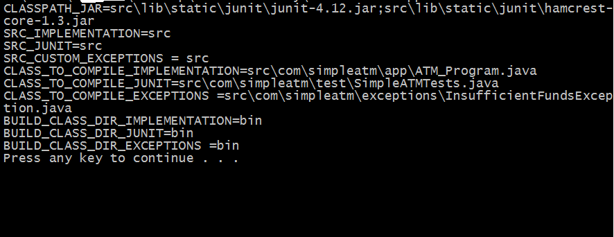
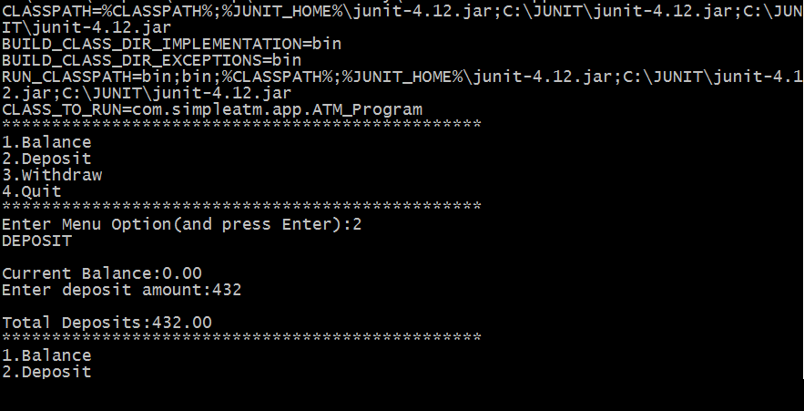
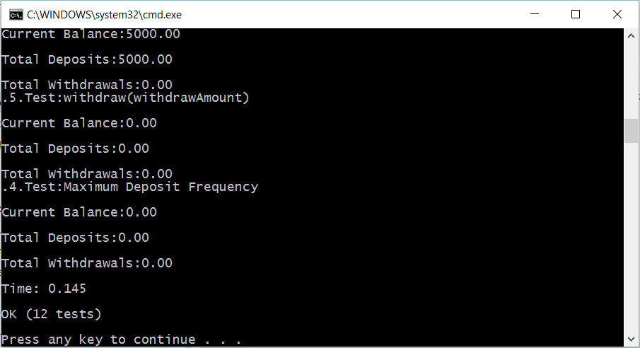

### A Simple ATM console program

This simple java console program demonstrates 4 common operations via ATM.
That is Check Balance,Deposit Money,Withdraw Money and Quit the program

This program fulfils(somehow) the requirement of this exercise(exercise.pdf),found in the root of repo.

### Motivation
Programming is Understanding-Kristen Nygaard.
If you understand you explain.If you can't explain you don't understand!
Program meant for a total beginner.    

### How to run the program.

On windows environment,simply DOUBLE CLICK the *run-program.bat* batch file to run the program.

### How to run the unit test cases

On windows environment,simply DOUBLE CLICK the *run-tests.bat* batch file to run the unit tests.

### How to compile the program
 
DOUBLE CLICK the *compile.bat* batch file to compile the program,exceptions and the tests.
    
### ToDo
* Change the program to persist data to database
* Include calculations for interest rates etc
* Rewrite the program to simulate real world ATM where there is an Account for instance
    
### Screenshots

    
    
    

